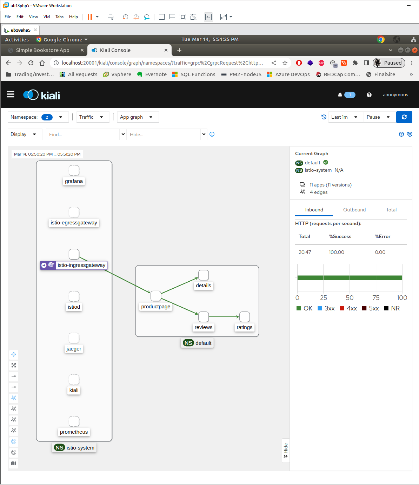
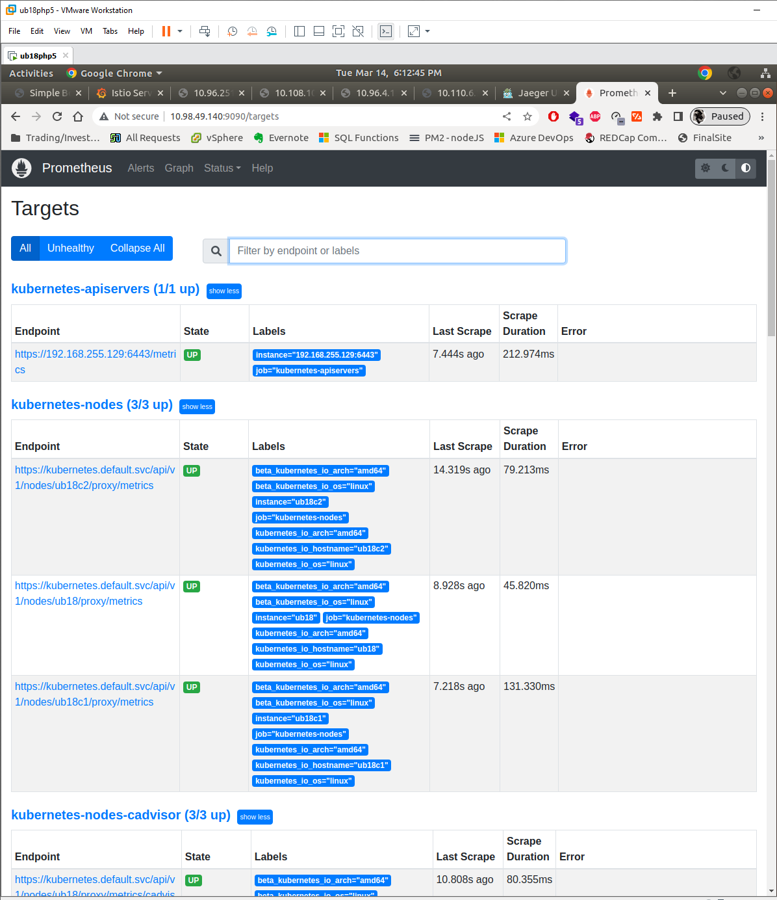

# Istio / Getting Started 
## https://istio.io/latest/docs/setup/getting-started/

# Download Istio
```bash
$ curl -L https://istio.io/downloadIstio | sh -
```

## Move to the Istio package directory. For example, if the package is istio-1.17.1:
```bash
$ cd istio-1.17.1
```

## Add the istioctl client to your path (Linux or macOS):
```bash
$ export PATH=$PWD/bin:$PATH
```

# Install Istio
```bash
$ istioctl install --set profile=demo -y
✔ Istio core installed
✔ Istiod installed
✔ Egress gateways installed
✔ Ingress gateways installed
✔ Installation complete
```

## Add a namespace label to instruct Istio to automatically inject Envoy sidecar proxies when you deploy your application later:
```bash
$ kubectl label namespace default istio-injection=enabled
namespace/default labeled
```

# Deploy the sample application
## Deploy the Bookinfo sample application:

```bash
$ kubectl apply -f samples/bookinfo/platform/kube/bookinfo.yaml
service/details created
serviceaccount/bookinfo-details created
deployment.apps/details-v1 created
service/ratings created
serviceaccount/bookinfo-ratings created
deployment.apps/ratings-v1 created
service/reviews created
serviceaccount/bookinfo-reviews created
deployment.apps/reviews-v1 created
deployment.apps/reviews-v2 created
deployment.apps/reviews-v3 created
service/productpage created
serviceaccount/bookinfo-productpage created
deployment.apps/productpage-v1 created
```

## The application will start. As each pod becomes ready, the Istio sidecar will be deployed along with it.

```bash
$ kubectl get services -o wide
NAME          TYPE        CLUSTER-IP       EXTERNAL-IP   PORT(S)    AGE   SELECTOR
details       ClusterIP   10.107.127.254   <none>        9080/TCP   45m   app=details
kubernetes    ClusterIP   10.96.0.1        <none>        443/TCP    52m   <none>
productpage   ClusterIP   10.96.251.172    <none>        9080/TCP   45m   app=productpage
ratings       ClusterIP   10.108.102.117   <none>        9080/TCP   45m   app=ratings
reviews       ClusterIP   10.96.4.130      <none>        9080/TCP   45m   app=reviews
```

and

```bash
$ kubectl get pods -o wide
NAME                             READY   STATUS    RESTARTS   AGE   IP            NODE     NOMINATED NODE   READINESS GATES
details-v1-5ffd6b64f7-87ghl      2/2     Running   0          46m   9.9.251.67    ub18c2   <none>           <none>
productpage-v1-979d4d9fc-bxbp7   2/2     Running   0          46m   9.9.234.133   ub18c1   <none>           <none>
ratings-v1-5f9699cfdf-dk4kd      2/2     Running   0          46m   9.9.234.132   ub18c1   <none>           <none>
reviews-v1-569db879f5-sx8ns      2/2     Running   0          46m   9.9.251.66    ub18c2   <none>           <none>
reviews-v2-65c4dc6fdc-crhmf      2/2     Running   0          46m   9.9.234.131   ub18c1   <none>           <none>
reviews-v3-c9c4fb987-hrt4c       2/2     Running   0          46m   9.9.251.68    ub18c2   <none>           <none>
```

and 

```bash
$ kubectl -n istio-system get service
NAME                   TYPE           CLUSTER-IP       EXTERNAL-IP   PORT(S)                                                                      AGE
grafana                ClusterIP      10.111.118.132   <none>        3000/TCP                                                                     39m
istio-egressgateway    ClusterIP      10.109.129.204   <none>        80/TCP,443/TCP                                                               51m
istio-ingressgateway   LoadBalancer   10.102.166.160   <pending>     15021:31080/TCP,80:31890/TCP,443:30547/TCP,31400:31158/TCP,15443:31197/TCP   51m
istiod                 ClusterIP      10.104.250.96    <none>        15010/TCP,15012/TCP,443/TCP,15014/TCP                                        52m
jaeger-collector       ClusterIP      10.108.89.243    <none>        14268/TCP,14250/TCP,9411/TCP                                                 39m
kiali                  ClusterIP      10.111.5.116     <none>        20001/TCP,9090/TCP                                                           39m
prometheus             ClusterIP      10.98.49.140     <none>        9090/TCP                                                                     39m
tracing                ClusterIP      10.105.156.194   <none>        80/TCP,16685/TCP                                                             39m
zipkin                 ClusterIP      10.110.6.234     <none>        9411/TCP                                                                     39m

```

## Verify everything is working correctly up to this point. Run this command to see if the app is running inside the cluster and serving HTML pages by checking for the page title in the response:

```bash
$ kubectl exec "$(kubectl get pod -l app=ratings -o jsonpath='{.items[0].metadata.name}')" -c ratings -- curl -sS productpage:9080/productpage | grep -o "<title>.*</title>"
<title>Simple Bookstore App</title>
```

# Open the application to outside traffic

Associate this application with the Istio gateway:

```bash
$ kubectl apply -f samples/bookinfo/networking/bookinfo-gateway.yaml
gateway.networking.istio.io/bookinfo-gateway created
virtualservice.networking.istio.io/bookinfo created
```

Ensure that there are no issues with the configuration:

```bash
$ istioctl analyze
✔ No validation issues found when analyzing namespace: default.
```

# Verify external access
Check output from this command:

```bash
$ kubectl -n istio-system get service
NAME                   TYPE           CLUSTER-IP       EXTERNAL-IP   PORT(S)                                                                      AGE
istio-ingressgateway   LoadBalancer   10.102.166.160   <pending>     15021:31080/TCP,80:31890/TCP,443:30547/TCP,31400:31158/TCP,15443:31197/TCP   51m
```

## http://10.102.166.160/productpage


# View the dashboard

## Install Kiali and the other addons and wait for them to be deployed.

```bash
$ kubectl apply -f samples/addons
$ kubectl rollout status deployment/kiali -n istio-system
Waiting for deployment "kiali" rollout to finish: 0 of 1 updated replicas are available...
deployment "kiali" successfully rolled out
```

Access the Kiali dashboard.
```bash
$ istioctl dashboard kiali
```

In the left navigation menu, select Graph and in the Namespace drop down, select default.

To see trace data, you must send requests to your service. The number of requests depends on Istio’s sampling rate and can be configured using the Telemetry API. With the default sampling rate of 1%, you need to send at least 100 requests before the first trace is visible. To send a 100 requests to the productpage service, use the following commands:
```bash
$ for i in $(seq 1 100); do curl -s -o /dev/null "http://10.102.166.160/productpage"; done
$ while true; do curl -s -o /dev/null http://10.102.166.160/productpage; done
```

The Kiali dashboard shows an overview of your mesh with the relationships between the services in the Bookinfo sample application. It also provides filters to visualize the traffic flow.




